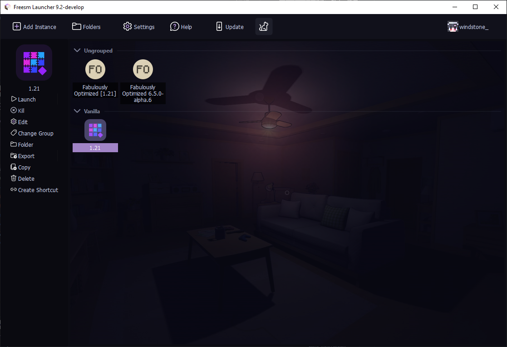
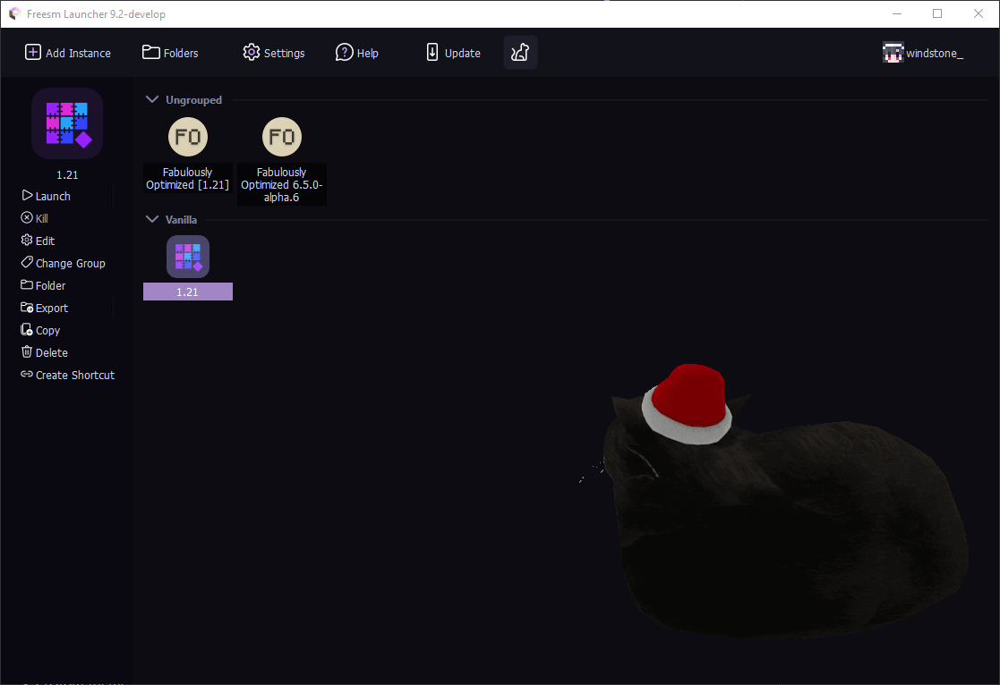

   
  
  

    
  

  
   

  

    <strong>English</strong> | <a href="https://github.com/FreesmTeam/FreesmLauncher/blob/develop/README_russian.md">Русский</a> 
  

  
  

    Freesm Launcher is a custom launcher for Minecraft that allows you to easily manage multiple installations of Minecraft at once and login with offline account without any restrictions. 
     This is a <b>fork</b> of the Prism Launcher and is <b>not</b> endorsed by it. <!-- isn't it good? :) -->
  

## Screenshots

  

Expand more

  
  
  
  
  
  
  

## Differences between Prism Launcher and Freesm Launcher

- Offline mode doesn't require an account.

- Custom theme and icons.

- Gif support for cat packs.

- Image cropping support for cat packs with names containing "screenshot" or "fullscreen"

- More cat packs.

- No welcome message on the home screen.

- Disabled Java compatibility checks by default.

## Installation

- All downloads and instructions for Freesm Launcher can be found on our [Website](https://freesmlauncher.windstone.space).
- Release builds are located in [Github Releases](https://github.com/FreesmTeam/FreesmLauncher/releases) tab.
- You can also install development builds.

### Development Builds

Please understand that these builds are not intended for most users. There may be bugs, and other instabilities. You have been warned.

There are development builds available through:

- [GitHub Actions](https://github.com/FreesmTeam/FreesmLauncher/actions) (includes builds from pull requests opened by contribuitors)
- [nightly.link](https://nightly.link/FreesmTeam/FreesmLauncher/workflows/trigger_builds/develop) (this will always point only to the latest version of develop)

These have debug information in the binaries, so their file sizes are relatively larger.

Prebuilt Development builds are provided for **Linux**, **Windows** and **macOS**.

## Community & Support

Feel free to create a GitHub issue if you find a bug or want to suggest a new feature.

> [!WARNING]
> Do not mention Freesm Launcher on Prism Launcher Discord, Forum, GitHub and etc. Freesm - standalone project, that only takes code base from Prism and (mayber in future) will have it's own site, Discord and etc.

## Translations

The translation effort for Freesm Launcher is hosted on [Weblate](https://hosted.weblate.org/projects/freesmlauncher/freesmlauncher-launcher/) and information about translating Freesm Launcher is available at <https://github.com/FreesmTeam/Translations>.

## Building

If you want to build Freesm Launcher yourself, check the [Build Instructions for Prism Launcher](https://prismlauncher.org/wiki/development/build-instructions/).

## Basic info

- We **ARE NOT** related to the [Prism Launcher](https://prismlauncher.org) team.

- We **ARE NOT** collecting your information. Don't trust? - Check it yourself.

- We **ARE** providing _the_ way to play Minecraft for free.

- We **ARE** open to contributing our builds.

## License

All launcher code is available under the GPL-3.0-only license.

