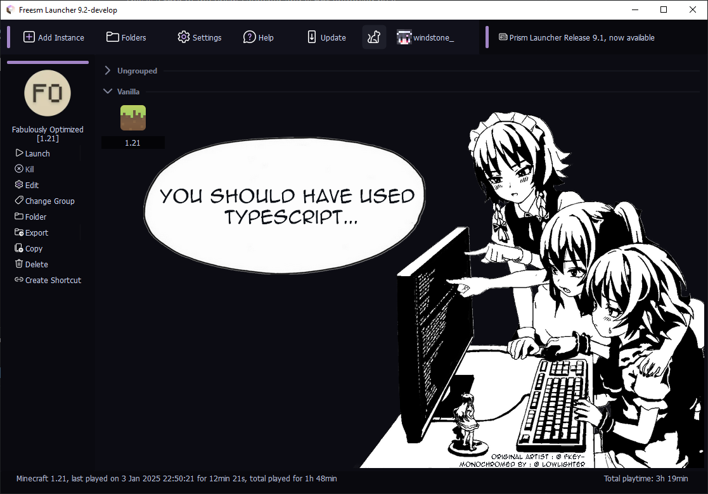
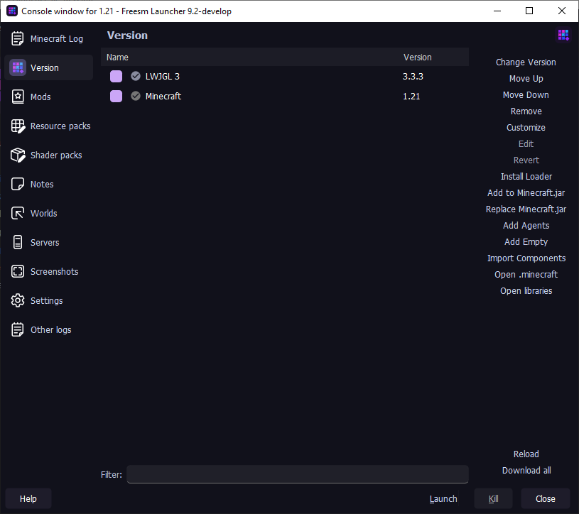

   
  
  

    
  

  
   

  

    <a href="https://github.com/FreesmTeam/FreesmLauncher/blob/develop/README.md">English</a> | <strong>Русский</strong> 
  

  
  

    Freesm Launcher - это лаунчер Minecraft с открытым исходным кодом, офлайн-игрой без лицензии и возможностью управления несколькими версиями, учетными записями и модами. 
     Это <b>форк</b> Prism лаунчера, который <b>не</b> поддерживается им. <!-- isn't it good? :) -->
  

## Скриншоты

  

Раскрыть ещё

  
  
  
  

## Разница между Prism и Freesm лаунчерами

- Для офлайн-игры не требуется лицензионный аккаунт.

- Добавлены кастомные иконки и тема.

- Убрано приветственное сообщение на главном экране.

- Больше "cat" паков (сплеш скринов).

- Выключенные проверки Java по умолчанию.

## Установка

- Все ссылки на скачивание и инструкции для Freesm Launcher'а могут быть найдены на нашем веб-сайте (WIP)
- Релизные версии находятся во вкладке [Github Releases](https://github.com/FreesmTeam/FreesmLauncher/releases).
- Вы также можете установить сборки разработчика.

### Сборки разработчика

Сборки разработчика могут содержать баги и быть нестабильны. Рекомендуем использовать релизные версии.

Данные сборки доступны в следующих местах:

- [GitHub Actions](https://github.com/FreesmTeam/FreesmLauncher/actions)
- [nightly.link](https://nightly.link/FreesmTeam/FreesmLauncher/workflows/trigger_builds/develop) (ссылка всегда будет указывать на последнюю версию сборки)

В этих версиях присутствует отладочная информация, поэтому размеры лаунчера будут больше, чем у релизных версий.

Готовые сборки разработчика представлены для: **Linux**, **Windows** и **macOS**.

Prebuilt Development builds are provided for **Linux**, **Windows** and **macOS**.

## Тех. поддержка и сообщества

Смело открывайте GitHub issue, если Вы вдруг нашли какой-то баг или хотите предложить что-то новое.

> [!WARNING]
> Не упоминайте Freesm Launcher в дискорде, форуме, гитхабе и т.п. Prism Launcher'а. Freesm - это проект, который лишь основан на коде Prism Launcher'а. В будущем планируется создать отдельный сайт, дискорд-сервер и т.д.

## Переводы

Freesm Launcher базируется на переводах Prism Launcher'а.

Переводы для Prism хостятся на [Weblate](https://hosted.weblate.org/projects/prismlauncher/launcher/), и вся информация по ним доступна на <https://github.com/PrismLauncher/Translations>.

## Сборка

Если Вы хотите собрать Freesm Launcher самостоятельно, используйте [инструкции для сборки Prism Launcher'а](https://prismlauncher.org/wiki/development/build-instructions/).

## Прочая информация

- Мы **НЕ** связаны с командой [Prism Launcher](https://prismlauncher.org).

- Мы **НЕ** не собираем какую-либо информацию. Не верите? Проверьте сами.

- Мы **ПРЕДОСТАВЛЯЕМ** _возможность_ игры в Minecraft бесплатно.

- Мы **ОТКРЫТЫ** к коммитам сообщества.

## Лицензия

Весь код лаунчера находится под лицензией GPL-3.0.

