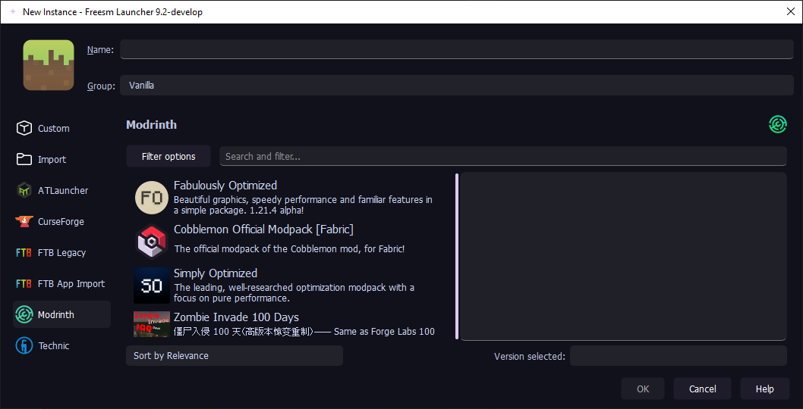

   
  
  

    
  

  
   

  

    <a href="https://github.com/FreesmTeam/FreesmLauncher/blob/develop/README.md">English</a> | <strong>Русский</strong> 
  

  
  

    Freesm Launcher - лаунчер Minecraft с открытым исходным кодом, офлайн-игрой без лицензии и возможностью управления несколькими версиями, учетными записями и модами. 
     Это <b>форк</b> Prism лаунчера, который <b>не</b> поддерживается им. <!-- isn't it good? :) -->
  

## Скриншоты

  

Раскрыть ещё

  
  
  
  

## Разница между лаунчером Prism и лаунчером Freesm

- Для офлайн-игры не требуется лицензионный аккаунт.

- Добавлены кастомные иконки и тема.

- Убрано приветственное сообщение на главном экране.

- Больше "кот" паков (сплеш скринов).

- Выключенные проверки Java по умолчанию.

## Установка

- All downloads and instructions for Freesm Launcher can be found on our [Website] (WIP). 
- Release builds are located in [Github Releases](https://github.com/FreesmTeam/FreesmLauncher/releases) tab.
- You can also install development builds.

### Нестабильные сборки

Please understand that these builds are not intended for most users. There may be bugs, and other instabilities. You have been warned.

There are development builds available through:

- [GitHub Actions](https://github.com/FreesmTeam/FreesmLauncher/actions) (includes builds from pull requests opened by contribuitors)
- [nightly.link](https://nightly.link/FreesmTeam/FreesmLauncher/workflows/trigger_builds/develop) (this will always point only to the latest version of develop)

These have debug information in the binaries, so their file sizes are relatively larger.

Prebuilt Development builds are provided for **Linux**, **Windows** and **macOS**.

## Тех. поддержка и сообщества

Feel free to create a GitHub issue if you find a bug or want to suggest a new feature.

> [!WARNING]
> Do not mention Freesm Launcher on Prism Launcher Discord, Forum, GitHub and etc. Freesm - standalone project, that only takes code base from Prism and (mayber in future) will have it's own site, Discord and etc. 

## Переводы

The translation effort for Prism Launcher is hosted on [Weblate](https://hosted.weblate.org/projects/prismlauncher/launcher/) and information about translating Prism Launcher is available at <https://github.com/PrismLauncher/Translations>.

## Сборка

If you want to build Freesm Launcher yourself, check the [Build Instructions](https://prismlauncher.org/wiki/development/build-instructions/).

## Прочая информация

- We **ARE NOT** related to the [Prism Launcher](https://prismlauncher.org).

- We **ARE NOT** collecting your information. Don't trust? - Check it yourself.

- We **ARE** providing _the_ way to play Minecraft for free.

- We **ARE** open to contributing our builds.

## Лицензия

All launcher code is available under the GPL-3.0-only license. 

