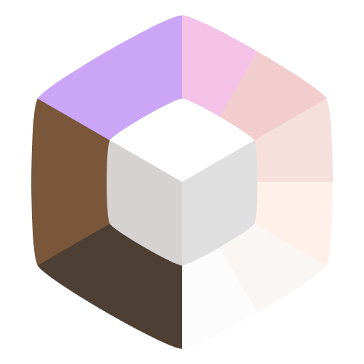

<h1>
<a style="color:#f5c2e7" href="https://freesmlauncher.org/">Freesm Launcher</a>
</h1>

A Prism Launcher fork that **removes offline account restrictions**, adds custom auth server support and provides more customization

This fork is **not** endorsed by Prism Launcher

<strong>English</strong> | <a style="color:#f5c2e7" href="./README_ru.md">Русский</a>

## 💻 Screenshots

  
Show

  

    

      
      
      
      
      
      
      
      
    

  

## ✨ Features

- Offline mode doesn't require signing in with a microsoft account anymore
- [Ely.by](https://ely.by/) can be used as an account auth option, providing a seamless integration with minecraft. You will see your minecraft skin anywhere without any mods or plugins
- Custom authentication server support
- Polished, minimalist dark and light themes based on a [Fluent-Dark](https://github.com/PrismLauncher/Themes/tree/main/themes/Fluent-Dark) theme with [catppuccin](https://catppuccin.com/)/[rosé pine](https://rosepinetheme.com/) colors and [Microsoft Fluent](https://fluent2.microsoft.design/iconography) icons
- Animated GIF cat packs with image cropping support
- In-game screenshots copying to the buffer history support
- Animated snow effect for those who love... snow?
- Random username and instance icon selection with ultra super advanced and cryptographically secure, absolutely random number generator based on the [lavarand](https://en.wikipedia.org/wiki/Lavarand)
- FLOSS
- ...all the Prism Launcher's features

## 📊 Comparison

| Feature                                                   | Freesm  Launcher | Shattered  Prism | HMCL | Fjord   | PollyMC       | ElyPrism      | UltimMC | Prism-Cracked | Prism Launcher |
|-----------------------------------------------------------|------------------|------------------|------|---------|---------------|---------------|---------|---------------|----------------|
| Offline Mode without a Microsoft account                  | ✅                | ✅                | ✅    | ❌       | ✅             | ✅             | ✅       | ✅             | ❌              |
| FTB packs                                                 | ✅                | ✅                | ❌    | ✅       | ✅             | ✅             | ❌       | ✅             | ✅              |
| Ely.by support¹                                           | ✅                | 🟨               | 🟨   | 🟨      | 🟨            | ✅             | 🟨      | ❌             | ❌              |
| Authlib-injector support²                                 | ✅                | ✅                | ✅    | ✅       | ✅             | ❌             | ❌       | ❌             | ❌              |
| Custom Authlib-injector jar support²                      | ❌                | ✅                | ❌    | ✅       | ❌             | ❌             | ❌       | ❌             | ❌              |
| Differentiating between auth servers                      | ✅                | ✅                | ✅    | ✅       | ❌             | ❌             | ❌       | ❌             | ❌              |
| Animated Cat Packs & Cropping                             | ✅                | ❌                | ❌    | ❌       | ❌             | ❌             | ❌       | ❌             | ❌              |
| Screenshots saving to the buffer history without any mods | ✅                | ❌                | ❌    | ❌       | ❌             | ❌             | ❌       | ❌             | ❌              |
| Fork                                                      | PrismLauncher    | FjordLauncher    | ❌    | PollyMC | PrismLauncher | PrismLauncher | MultiMC | PrismLauncher | PolyMC         |

¹ If it is marked as "🟨", then skins won't work in many cases, because the provided launcher doesn't use official Ely.by authlib patches

² If it is marked as "❌", you can still change a `javaagent` JVM argument to use your `authlib-injector` jar file as an auth server

// old

---

## 📥 Installation

### 🏷️ Stable Releases

Download Freesm Launcher from our [official website](https://freesmlauncher.org) or the [GitHub Releases](https://github.com/FreesmTeam/FreesmLauncher/releases) page. Packages available for **Windows, macOS, and Linux (x86-64)**.

### 🌙 Development Builds

For the latest features, check out the [GitHub Actions](https://github.com/FreesmTeam/FreesmLauncher/actions) artifacts or [Nightly Builds](https://nightly.link/FreesmTeam/FreesmLauncher/workflows/develop) (not recommended for most users).

> [!CAUTION]  
> Development (nightly) builds may be unstable, larger, and contain debug info. Use **at your own risk**.

---

## 💬 Community & Support

If you find bugs or want to suggest features, please open an issue on our [GitHub repository](https://github.com/FreesmTeam/FreesmLauncher). Pull requests and contributions (code, docs, translations) are welcome!

> [!CAUTION]  
> Do not mention Freesm Launcher on Prism Launcher’s Discord, forums, or other channels. Freesm is a standalone project and has its own community.

> [!NOTE]  
> Freesm does **not collect any personal data** or usage information. All features run locally. The source code is fully open under GPL-3.0 for your audit.

---

## 🌐 Translations

<!-- Freesm Launcher supports community translations via [Weblate](https://hosted.weblate.org/projects/freesmlauncher/). Help us translate or improve existing translations by visiting our [Weblate page](https://hosted.weblate.org/projects/freesmlauncher/) or our [GitHub Translations guide](https://github.com/FreesmTeam/Translations). -->

---

## 🛠️ Building from Source

To build Freesm Launcher yourself, see the [Prism Launcher build instructions](https://prismlauncher.org/wiki/development/build-instructions/) (Freesm uses Garnix build system).  
The source code is available on GitHub. Contributions to build scripts and packaging are welcome.

---

## 📜 License

Freesm Launcher is free software under the **GPL-3.0-only** license. See the [LICENSE](LICENSE) file for details.
