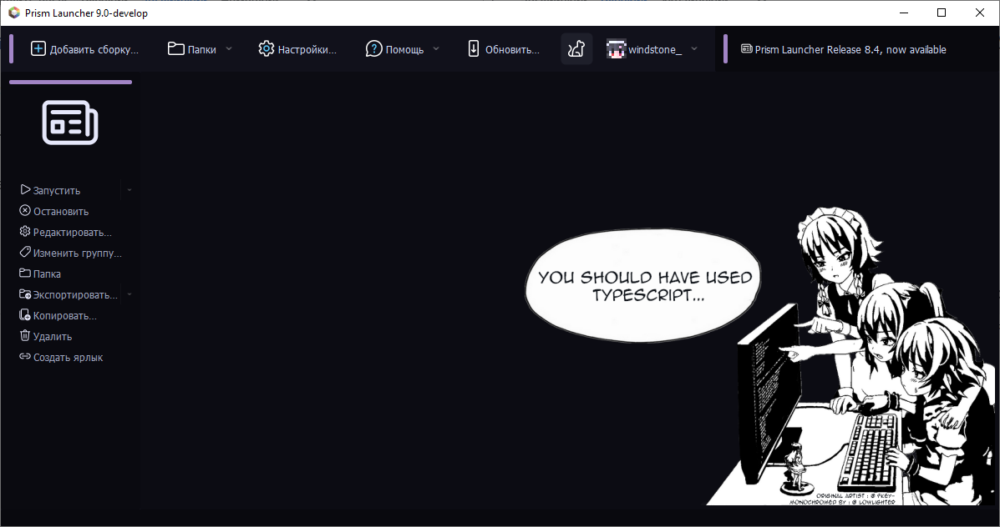
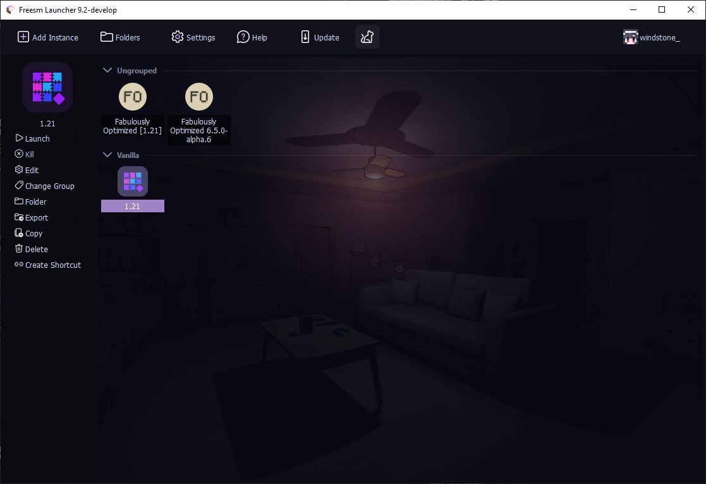
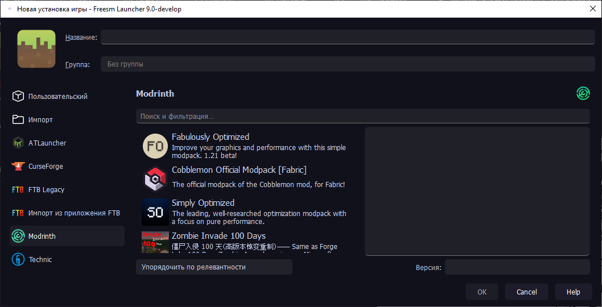
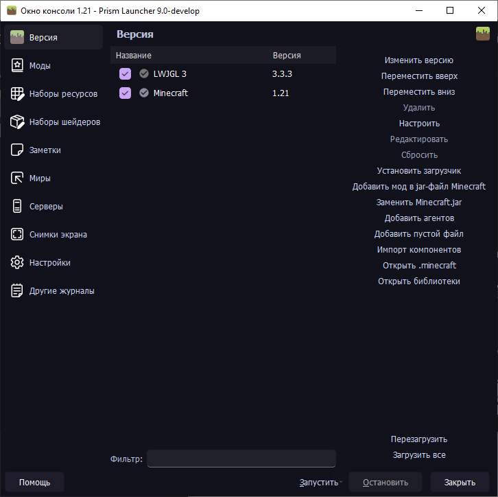
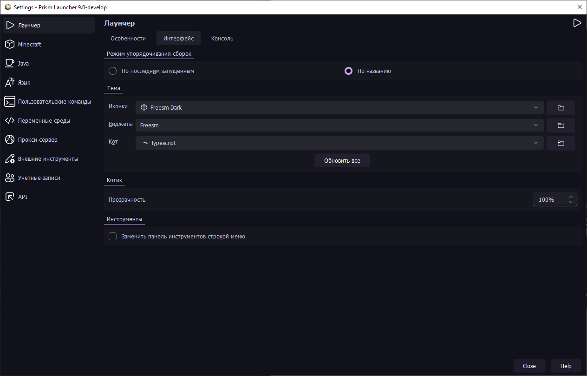

   

  

    
  

   

  

    <strong>Не такая уж и "призма", как вы думаете.</strong> 
    

      <a href="https://github.com/FreesmTeam/FreesmLauncher/blob/develop/docs/README.md" style="text-decoration: none;">
         English
      </a>
      |
      <a href="#" style="text-decoration: none;">
         Русский
      </a>
    

  

  

    Freesm Launcher — это пользовательский лаунчер для Minecraft, который позволяет легко управлять несколькими установками Minecraft и входить в игру с офлайн-аккаунтом без ограничений. 
     Это <b>форк</b> Prism Launcher, который <b>не</b> поддерживается им.
  

<h2>Скриншоты</h2>

Ознакомьтесь с основными функциями Freesm Launcher через эти визуальные материалы, демонстрирующие интерфейс, темы и многое другое.

  

  
📷 Показать больше

  

    
    
    
    
    
    
    
  

<h2>Разница между Prism Launcher и Freesm Launcher</h2>

<table style="width: 100%; border-collapse: collapse; text-align: left;">
  <thead>
    <tr style="background-color: #f2f2f2;">
      <th style="padding: 10px; border: 1px solid #ddd;">Особенность</th>
      <th style="padding: 10px; border: 1px solid #ddd;">Freesm Launcher</th>
      <th style="padding: 10px; border: 1px solid #ddd;">Prism Launcher</th>
    </tr>
  </thead>
  <tbody>
    <tr>
      <td style="padding: 10px; border: 1px solid #ddd;">Режим офлайн</td>
      <td style="padding: 10px; border: 1px solid #ddd;">Не требуется аккаунт</td>
      <td style="padding: 10px; border: 1px solid #ddd;">Требуется аккаунт</td>
    </tr>
    <tr>
      <td style="padding: 10px; border: 1px solid #ddd;">Поддержка Ely.by</td>
      <td style="padding: 10px; border: 1px solid #ddd;">Да</td>
      <td style="padding: 10px; border: 1px solid #ddd;">Нет</td>
    </tr>
    <tr>
      <td style="padding: 10px; border: 1px solid #ddd;">Кастомные темы и иконки</td>
      <td style="padding: 10px; border: 1px solid #ddd;">Да</td>
      <td style="padding: 10px; border: 1px solid #ddd;">Нет</td>
    </tr>
    <tr>
      <td style="padding: 10px; border: 1px solid #ddd;">Поддержка GIF для cat паков</td>
      <td style="padding: 10px; border: 1px solid #ddd;">Да</td>
      <td style="padding: 10px; border: 1px solid #ddd;">Нет</td>
    </tr>
    <tr>
      <td style="padding: 10px; border: 1px solid #ddd;">Обрезка изображений для cat паков</td>
      <td style="padding: 10px; border: 1px solid #ddd;">Да</td>
      <td style="padding: 10px; border: 1px solid #ddd;">Нет</td>
    </tr>
    <tr>
      <td style="padding: 10px; border: 1px solid #ddd;">Проверки совместимости Java</td>
      <td style="padding: 10px; border: 1px solid #ddd;">Отключены по умолчанию</td>
      <td style="padding: 10px; border: 1px solid #ddd;">Включены по умолчанию</td>
    </tr>
  </tbody>
</table>

<h2>Установка</h2>

<ul>
  <li>Все ссылки на скачивание и инструкции для Freesm Launcher можно найти на нашем <a href="https://freesmlauncher.windstone.space">сайте</a>.</li>
  <li>Релизные сборки можно найти на вкладке <a href="https://github.com/FreesmTeam/FreesmLauncher/releases">GitHub Releases</a>.</li>
  <li>Вы также можете установить сборки разработчика.</li>
</ul>

<h3>Нестабильные сборки</h3>

Имейте в виду, что эти сборки могут содержать ошибки и быть нестабильными. Мы не рекомендуем использовать их в большинстве случаев.

Доступные нестабильные сборки могут быть получены через:

<ul>
  <li><a href="https://github.com/FreesmTeam/FreesmLauncher/actions">GitHub Actions</a> (сборки из пулл-реквестов участников).</li>
  <li><a href="https://nightly.link/FreesmTeam/FreesmLauncher/workflows/trigger_builds/develop">nightly.link</a> (ссылка всегда будет указывать на последнюю версию из develop).</li>
</ul>

Эти сборки содержат отладочную информацию, поэтому их размер будет больше. Предоставляемые сборки доступны для <strong>Linux</strong>, <strong>Windows</strong> и <strong>macOS</strong>.

<h2>Сообщество и поддержка</h2>

Не стесняйтесь создавать GitHub issue, если найдете ошибку или хотите предложить новую функцию.

> [!IMPORTANT]
> Не упоминайте Freesm Launcher на Discord, форуме или GitHub Prism Launcher. Freesm — это самостоятельный проект, основанный на кодовой базе Prism.

<h2>Переводы</h2>

Перевод для Freesm Launcher хостится на <a href="https://hosted.weblate.org/projects/freesmlauncher/freesmlauncher-launcher/">Weblate</a>. Информацию о переводах можно найти на <a href="https://github.com/FreesmTeam/Translations">GitHub</a>.

<h2>Сборка</h2>

Если вы хотите собрать Freesm Launcher самостоятельно, следуйте <a href="https://prismlauncher.org/wiki/development/build-instructions/">инструкциям по сборке Prism Launcher</a>.

<h2>Основная информация</h2>

<ul>
  <li>Мы <strong>НЕ</strong> связаны с командой <a href="https://prismlauncher.org">Prism Launcher</a>.</li>
  <li>Мы <strong>НЕ</strong> собираем вашу информацию. Не верите? Проверьте сами.</li>
  <li>Мы <strong>ПРЕДОСТАВЛЯЕМ</strong> возможность играть в Minecraft бесплатно.</li>
  <li>Мы <strong>ОТКРЫТЫ</strong> для коммитов от сообщества.</li>
</ul>

<h2>Лицензия</h2>

Весь код лаунчера доступен под лицензией GPL-3.0-only.

  

